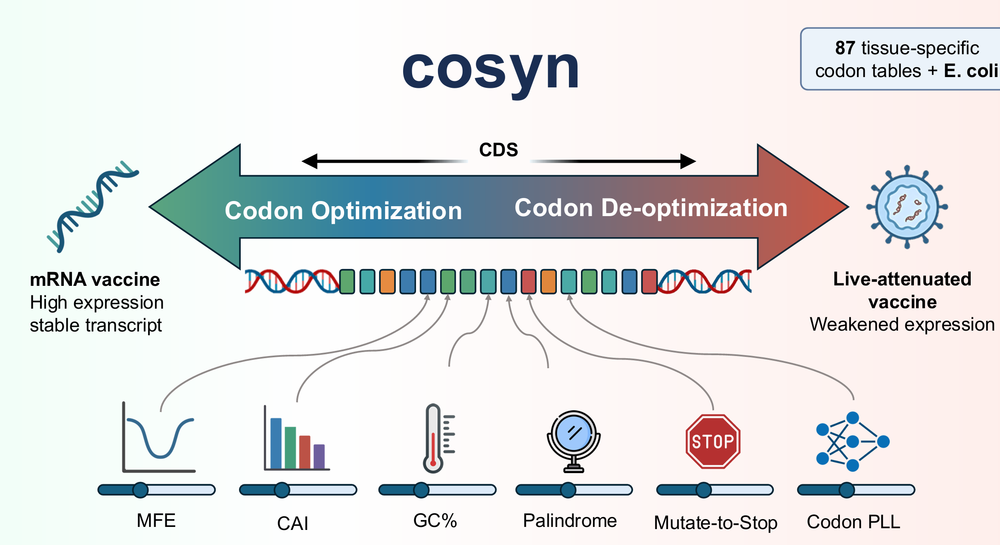

# Cosyn


**Cosyn** (codon synonymous engineering; /ˈkəʊsɪn/) is a unified computational framework for codon sequence design. It bridges the divide between expression-enhancing codon optimization and attenuation-focused deoptimization through three key innovations. First, Cosyn is **bidirectional**: by inverting the optimization objective, the same engine performs both codon optimization (for mRNA vaccines) and deoptimization (for live-attenuated viral vaccines), enabling seamless navigation across the full codon-usage spectrum. Second, Cosyn is **hybrid**: it couples a pre-trained codon language model for pseudo-log-likelihood (PLL) scoring with beam search and Markov-chain Monte Carlo (MCMC) to explore the synonymous sequence space. Third, Cosyn is **finely tunable**: six sequence-level objectives — CAI, MFE, GC content, palindrome avoidance, mutate-to-stop resistance, and neural codon fitness (PLL) — together with 87 tissue-specific codon frequency tables support context-aware design. Benchmarking against representative state-of-the-art tools demonstrates that Cosyn achieves wider phenotypic design-space coverage and higher sequence diversity, with experimental validation in HEK293T cells confirming bidirectional modulation of protein expression.



## Table of Contents

- [Core Design](#core-design-bidirectional--hybrid--finely-tunable)
- [Prerequisites](#prerequisites)
- [Installation](#installation)
- [Quick Start](#quick-start)
- [Subcommands Overview](#subcommands-overview)
- [Optimization Commands](#optimization-commands)
  - [`fit` — Strategy-Based Optimization](#fit--strategy-based-optimization)
  - [`ufit` — Unified Multi-Objective Optimization (Advanced)](#ufit--unified-multi-objective-optimization-advanced)
  - [MCMC Search](#mcmc-search-fit--ufit)
  - [`snp` — Localized SNP Optimization](#snp--localized-snp-optimization)
- [Evaluation Commands](#evaluation-commands)
  - [`assay` — Comprehensive Sequence Assay](#assay--comprehensive-sequence-assay)
  - [Individual Commands](#individual-evaluation-commands)
- [Configuration & Exploration](#configuration--exploration)
  - [TOML Configuration](#configuration-driven-execution)
  - [Custom Codon Tables](#custom-codon-frequency-tables)
  - [Panoramic Design Exploration](#panoramic-design-exploration)
- [Parameter Reference](#parameter-reference)
  - [Window Size and Memory](#window-size-and-memory-usage)
  - [Codon PLL and GPU](#codon-pll-and-model-memory)
  - [CodonTransformer Model Export](#codontransformer-model-export)
  - [Data and Software Availability](#data-and-software-availability)
  - [All Parameters](#all-parameters)
- [Output Format](#output-format)
- [Performance Tuning](#performance-tuning)
- [Acknowledgments](#acknowledgments)
- [License](#license)

## Core Design: Bidirectional · Hybrid · Finely-Tunable

### Bidirectional — Optimize *and* De-optimize

Cosyn is designed to work in both directions: it can **optimize** codon sequences for high expression and stability, and it can **de-optimize** them for low expression and instability. This makes it suitable for two distinct but equally important applications:

| Direction | Goal | Application |
|-----------|------|-------------|
| **Optimization** (default) | Maximize CAI, GC, PLL; minimize MFE, palindromes, mutate-to-stop | **mRNA vaccine design** — stable, highly translated transcripts |
| **De-optimization** (`--maximize_loss`) | Minimize CAI, GC, PLL; maximize MFE, palindromes, mutate-to-stop | **Attenuated vaccine design** — weakened pathogens with reduced expression |

By flipping the sign of the loss function via `--maximize_loss`, the same engine that finds the "best" codons for expression can be repurposed to find the "worst" codons — turning a pathogenic sequence into a safer attenuated version without changing its amino-acid sequence.

### Hybrid — Beam Search + MCMC + Codon Language Model

Cosyn decouples sequence evaluation from sequence generation: a multi-objective composite loss function scores candidate sequences, while two complementary search engines — beam search and Markov-chain Monte Carlo (MCMC) — explore the synonymous codon space. A pre-trained CodonTransformer neural model provides pseudo-log-likelihood (PLL) scoring that captures complex codon-usage patterns beyond CAI.

| Component | Role | Behavior |
|-----------|------|----------|
| **Beam search** (default) | Extreme-optimization engine | Deterministic, width-controlled (`-w`); rapidly converges to a tight cluster of near-optimal sequences |
| **MCMC** (`--search-method mcmc`) | Divergent-exploration engine | Stochastic Metropolis-Hastings walk; samples many distinct sequences across a broad phenotypic range |
| **Codon PLL** (`-q/--pll_weight`) | Neural prior | Pre-trained codon language model; scores naturalness of codon usage patterns |

The two engines are complementary rather than competitive. Beam search excels at pushing individual objectives to their extremes; MCMC excels at generating diverse candidate sets for downstream experimental screening and at escaping local minima during deoptimization. This architectural decoupling of evaluator from searcher also avoids the distribution-matching conservatism of end-to-end generative models, enabling exploration of extreme variants outside the training distribution.

### Finely-Tunable — Six Independent Objectives

Unlike tools that hard-code a single objective, `ufit` exposes **independent weight sliders** for every metric:

| Metric | Weight Flag | Description |
|--------|-------------|-------------|
| **MFE** (Minimum Free Energy) | `-e/--mfe_weight` | RNA secondary-structure stability (kcal/mol). Lower (more negative) is more stable. |
| **CAI** (Codon Adaptation Index) | `-x/--cai_weight` | Codon usage bias toward the host tissue. Higher values indicate closer match to the host genome. |
| **GC%** | `-b/--gc_weight` | GC content. |
| **Palindrome** | `-m/--palindrome_weight` | Presence of palindromic subsequences. |
| **Mutate-to-Stop** | `-d/--m2s_weight` | Susceptibility of single-nucleotide mutations creating stop codons. |
| **Codon PLL** | `-q/--pll_weight` | Pseudo-log-likelihood from a CodonTransformer neural model. |

Set any weight to `0` to disable that objective. Set negative weights to *invert* the optimization direction (e.g. de-optimize CAI).

---

## Prerequisites

Choose the build target that matches your available dependencies:

| Dependency | `make release` | `make release_cpu` | `make release_no_pll` |
|---|---|---|---|
| **Rust** ≥ 1.67.1 | ✅ | ✅ | ✅ |
| **g++** (C++17) | ✅ | ✅ | — |
| **libtorch** (CUDA) | ✅ | — | — |
| **libtorch** (CPU) | — | ✅ | — |

> **Note:** Conda environments may cause link errors. Deactivate conda before building if you encounter issues.

---

## Installation

### Apptainer container (recommended for reproducibility)

Pre-built Apptainer image recipes are provided under `apptainer/`. This is the easiest way to run Cosyn without manually installing Rust, g++, or libtorch on the host.

#### Requirements

- **CPU architecture:** `x86_64` (the provided libtorch wheels and CUDA toolkit are built for amd64).
- **Apptainer** ≥ 1.0 with `--fakeroot` support (for building; running only needs a normal install).
- **For GPU:** a working NVIDIA driver. The GPU image embeds **CUDA 11.8**, so the host driver must be **≥ 450.80.02** (R450+). No host CUDA toolkit, cuDNN, or NCCL is required.

#### Install Apptainer on Ubuntu

```bash
# install the distribution package (Ubuntu 24.04+)
sudo apt-get update
sudo apt-get install -y apptainer
```

#### Build and run the images

```bash
# CPU-only image
apptainer exec cosyn_cpu.sif cosyn -h

# GPU image (embeds CUDA 11.8 + cuDNN 8 + NCCL + libtorch cu118)
apptainer exec cosyn_gpu.sif cosyn -h
```


### Compile from source

Cosyn offers three build configurations depending on your needs and available dependencies:

| Build target | PLL support | Requires | Binary name |
|---|---|---|---|
| `make release` | ✅ GPU | Rust + g++ + libtorch (CUDA) | `cosyn` |
| `make release_cpu` | ✅ CPU-only | Rust + g++ + libtorch (CPU) | `cosyn` |
| `make release_no_pll` | ❌ | Rust only | `cosyn_no_pll` |

```bash
# GPU-enabled build (default) — requires libtorch with CUDA
make release

# CPU-only PLL build — requires libtorch CPU (no GPU needed)
make release_cpu

# Minimal build — no PLL, no C++ dependencies
make release_no_pll
```

All binaries are placed at `target/release/cosyn` (or `target/release/cosyn_no_pll` for the PLL-free build).

> **Note:** Conda environments may cause link errors. Deactivate conda before building if you encounter issues.

---

## Quick Start

```bash
# ── Beginner: fit with preset strategies ──
cosyn fit -f input.fa -c hc -w 50                 # Default: MFE + CAI + GC
cosyn fit -f input.fa -c hc --gc_cai              # CAI + GC only (fast, no MFE)
cosyn fit -f input.fa -c hc --maximize_loss       # De-optimize: attenuate expression

# ── Advanced: ufit with independent weight sliders ──
cosyn ufit -f input.fa -c hc -w 50 -e 1 -x 1 -b 1 # Equivalent to default fit
cosyn ufit -f input.fa -c hc -e 0 -x 1 -b 1 -m 1  # Exclude MFE, add palindrome
cosyn ufit -f input.fa -c hc -q 0.5 -j model.pt   # Add neural PLL guidance

# ── Evaluation ──
cosyn assay -f input.fa -c hc                      # Full 5-metric evaluation
cosyn cai -f input.fa -c hc                        # CAI only
cosyn mfe -f input.fa                              # MFE only

# ── Exploration & batch ──
cosyn explore -f input.fa -c hc -o explore_out     # Sweep optimized→deoptimized
cosyn run-config -c config.toml                    # Reproducible batch run
```

---

## Configuration-Driven Execution

For pipelines or repeated runs, you can write a TOML configuration file and invoke it with the `run-config` subcommand. This avoids long command lines and keeps parameter sets under version control.

```bash
# Print a commented example configuration to stdout
cosyn run-config --print-default-config > config.toml

# Edit config.toml, then run
cosyn run-config -c config.toml
```

The `command` field selects which subcommand to execute. Only the matching section (e.g. `[fit]`, `[ufit]`, `[assay]`) is read; all other sections are ignored. An annotated example is provided in [`example/config_example.toml`](example/config_example.toml).

---

## Custom Codon Frequency Tables

In addition to the 87 built-in codon tables, cosyn supports **user-defined tables** via TOML files. Pass a `.toml` file path to `-c` instead of a built-in short name:

```bash
cosyn ufit -f input.fa -c my_custom_table.toml
```

The TOML format uses amino-acid single-letter codes as section headers, with codon=frequency pairs inside. Frequencies within each amino acid should sum to ~1.0:

```toml
[A]
GCT = 0.26
GCC = 0.40
GCA = 0.23
GCG = 0.11

[C]
TGT = 0.45
TGC = 0.55
# ... 21 amino acids including "*" for stop codons
```

A complete template based on the Human Common (`hc`) table is at [`example/codon_table_template.toml`](example/codon_table_template.toml).

---

## Panoramic Design Exploration

The `explore` subcommand automatically generates a diverse set of designs for a single input sequence, sweeping across three expression zones:

- **Optimized**: `fit --gc_cai` and `fit --pmgc`
- **Intermediate**: `fit --gc_cai --search-method mcmc` with limited iterations
- **Deoptimized**: `ufit --maximize_loss` with CAI/GC weights tuned for low expression

```bash
# Default scan with the human common codon table
cosyn explore -f input.fa -c hc -o explore_out

# Also scan the E. coli table to see cross-host behavior
cosyn explore -f input.fa -c hc --extra-tables ecoli -o explore_out

# Skip MFE calculation entirely (faster, pure CAI/GC-driven design)
cosyn explore -f input.fa -c hc -o explore_out --skip-mfe

# Add a PLL-guided intermediate MCMC mode (requires a CodonTransformer JIT model)
cosyn explore -f input.fa -c hc -o explore_out --skip-mfe \
  --pll-weight 0.5 --model-path /path/to/codon_transformer_human.pt

# Use only the intermediate zone, with custom MCMC iterations
cosyn explore -f input.fa -c hc --no-opt --no-deopt --intermediate-iters 50,200,500
```

Output files in `explore_out/`:

| File | Content |
|------|---------|
| `explore_summary.csv` | One row per design with CAI, GC%, MFE, etc. |
| `explore_summary.json` | The same data as JSON, plus top-level `params` and a per-row `command` field |
| `explore_all.fasta` | All designed sequences in one FASTA file |
| `explore_commands.txt` | Equivalent CLI command for each design |
| `*_out_lambda_*_seq_*_fit.json` | Per-mode detailed results, including a top-level `params` object with all runtime options |
| `*_out_lambda_*_seq_*_fit.fasta` | Per-mode sequence FASTA |


---

## Subcommands Overview

```
USAGE:
    cosyn <SUBCOMMAND>

OPTIMIZATION (design new sequences):
    fit           Beginner-friendly: preset strategy flags (--gc_cai, --mfe_cai, ...)
    ufit          Advanced: independent weight sliders (-e, -x, -b, -m, -d, -q)
    snp           Localized SNP/point-mutation optimization
    explore       Panoramic sweep: optimized → intermediate → deoptimized

EVALUATION (measure existing sequences):
    assay         Full 5/6-metric assay in one pass
    cai           CAI only
    mfe           MFE only (LinearFold)
    gc            GC content + theoretical min/max
    palindrome    Find palindromic subsequences
    mutate2stop   Count mutate-to-stop susceptible sites
    codon-pll     Neural pseudo-log-likelihood (CodonTransformer)

BATCH & CONFIG:
    run-config    Run from a TOML configuration file
```

---

## Optimization Commands

### `fit` — Strategy-Based Optimization

`fit` is the **entry-level** optimization command. Instead of tuning individual weights, you select a preset strategy with simple boolean flags. It covers the most common use cases in a single line.

```bash
# Default: jointly optimize MFE + CAI + GC (beam search)
cosyn fit -f input.fa -c hc -w 50

# GC + CAI only — skip MFE for speed (3–10× faster)
cosyn fit -f input.fa -c hc --gc_cai

# MFE + CAI only — ignore GC (useful for non-GC-rich hosts like E. coli)
cosyn fit -f input.fa -c hc --mfe_cai

# Add palindrome avoidance
cosyn fit -f input.fa -c hc --palindrome

# De-optimize: maximize loss → lower expression (attenuation design)
cosyn fit -f input.fa -c hc --maximize_loss

# Use arithmetic CAI in the objective
cosyn fit -f input.fa -c hc --cai-mode arithmetic
```

**Strategy flags (fit only):**

| Flag | What it does |
|------|---------------|
| *(none)* | MFE + CAI + GC (default) |
| `--gc_cai` | GC + CAI only; MFE is not computed |
| `--mfe_cai` | MFE + CAI only; GC is ignored |
| `--palindrome` | Add palindrome score to the objective |
| `--pmgc` | Palindrome + M2S + GC + CAI (omit MFE for speed) |
| `--cmgmp` |  Five objectives: CAI + MFE + GC + M2S + Palindrome |

### `ufit` — Unified Multi-Objective Optimization (Advanced)

`ufit` exposes **independent weight sliders** for every metric. You control exactly which objectives matter and how much. Set any weight to `0` to disable, or use negative values to invert the direction.

```bash
# Equivalent to "fit --gc_cai": optimize CAI + GC, skip MFE
cosyn ufit -f input.fa -c hc -w 50 -e 0 -x 1 -b 1 -d 0 -m 0 -q 0

# MFE-heavy design (3× MFE weight, 1× CAI, 1× GC)
cosyn ufit -f input.fa -c hc -w 50 -e 3 -x 1 -b 1 -d 0 -m 0 -q 0

# All six objectives with neural PLL guidance
cosyn ufit -f input.fa -c hc -w 50 \
    -e 1 -x 1 -b 1 -m 0.5 -d 0.5 -q 0.3 \
    -j /path/to/codon_transformer_model.pt
```

**Weight flags (ufit only):**

| Flag | Weight | Default | Objective |
|------|--------|---------|-----------|
| `-e` | `--mfe_weight` | 1 | MFE (more negative = more stable) |
| `-x` | `--cai_weight` | 1.0 | CAI (higher = better translation) |
| `-b` | `--gc_weight` | 1.0 | GC% (closer to optimum = better) |
| `-m` | `--palindrome_weight` | 1.0 | Palindrome (fewer = better) |
| `-d` | `--m2s_weight` | 1.0 | Mutate-to-stop (fewer = better) |
| `-q` | `--pll_weight` | 0.0 | Codon PLL (higher = better; needs `-j`) |
| `-j` | `--model_path` | — | Path to CodonTransformer `.pt` model |

### MCMC Search (fit & ufit)

Both `fit` and `ufit` support an alternative MCMC search engine (`--search-method mcmc`). MCMC proposes random synonymous codon substitutions and accepts or rejects them with a Metropolis-like criterion. It is often useful when you want to:

* Explore a broader, less extreme region of the Pareto front
* Optimize only a local window while keeping the rest of the sequence intact (`--mcmc-region`)
* Run a quick stochastic refinement without the memory cost of a large beam width

```bash
# Basic MCMC
cosyn fit -f input.fa -c hc --search-method mcmc --mcmc-iterations 500

# Local-region MCMC: optimize only bases 30–90 (codons 10–30)
cosyn fit -f input.fa -c hc --search-method mcmc --mcmc-region 30-90 --mcmc-iterations 1000

# MCMC with 5 independent traces (run in parallel via thread pool)
cosyn ufit -f input.fa -c hc --search-method mcmc \
    --mcmc-iterations 2000 --mcmc-traces 5 \
    -x 1 -b 1 -d 0 -m 0 
```

**MCMC parameters:**

| Parameter | Default | Description |
|-----------|---------|-------------|
| `--search-method` | `beam` | `beam` (deterministic) or `mcmc` (stochastic) |
| `--mcmc-iterations` | 1000 | Iterations per trace |
| `--mcmc-mutations` | 5 | Codons mutated per proposal |
| `--mcmc-accept-prob` | 0.5 | Fixed acceptance probability for worse proposals |
| `--mcmc-temperature` | 0.0 | Boltzmann temperature (overrides fixed prob if > 0) |
| `--mcmc-traces` | 1 | Independent chains (run in parallel via thread pool) |
| `--mcmc-region` | — | Restrict mutations to `start-end` (DNA/RNA only) |

**Acceptance criterion.** MCMC uses a Metropolis-like rule: better proposals are always accepted; worse proposals are accepted with a probability controlled by one of two mutually exclusive parameters:

| Mode | Parameter | How it works | Best for |
|---|---|---|---|
| **Fixed probability** | `--mcmc-accept-prob` (default 0.5) | All worse moves are accepted with the same flat probability, regardless of how much worse they are | Rapid, broad exploration; escaping deep local minima |
| **Boltzmann** | `--mcmc-temperature` (> 0) | Worse moves are accepted with probability exp(−Δloss / T). A small Δloss is likely accepted; a large Δloss is almost always rejected | Fine-tuning near a known good region; smoother convergence |

When `--mcmc-temperature` is set to any value > 0, it takes precedence and `--mcmc-accept-prob` is ignored.

### `snp` — Localized SNP Optimization

Optimize only the codons affected by a point mutation, leaving the rest of the sequence untouched.

```bash
cosyn snp -f input.fa -c hc --homopolymers 8 -s N4A           # Change residue 4 from N to A
```

---

## Evaluation Commands

### `assay` — Comprehensive Sequence Assay

Run all five classic metrics (CAI, MFE, GC%, palindrome, mutate-to-stop) in a single pass and emit one consolidated JSON. If a CodonTransformer model is supplied with `-j`, PLL is also computed and included in the output.

```bash
# 5-metric assay (no PLL)
cosyn assay -f input.fa -c hc

# 6-metric assay including CodonTransformer PLL
cosyn assay -f input.fa -c hc -j /path/to/codon_transformer_model.pt
```

Output structure (with `-j`, an additional `"pll"` key is present):
```json
{
  "cai": [...],
  "mfe": [...],
  "gc": [...],
  "palindrome": [...],
  "m2s": [...],
  "pll": [...]
}
```

### Individual Evaluation Commands

| Command | Example | What it measures |
|---------|---------|------------------|
| `cai` | `cosyn cai -f input.fa -c hc` | Codon Adaptation Index: geometric, scaled, and arithmetic |
| `mfe` | `cosyn mfe -f input.fa` | Minimum Free Energy via LinearFold |
| `gc` | `cosyn gc -f input.fa` | GC% plus theoretical min/max after optimization |
| `palindrome` | `cosyn palindrome -f input.fa` | Palindromic subsequences |
| `mutate2stop` | `cosyn mutate2stop -f input.fa` | Count of single-nt mutations that create stop codons |
| `codon-pll` | `cosyn codon-pll -f input.fa -j model.pt` | Neural pseudo-log-likelihood from CodonTransformer |

### Panoramic Design Commands

| Command | Example | What it does |
|---------|---------|--------------|
| `explore` | `cosyn explore -f input.fa -c hc -o explore_out` | Generate optimized, intermediate, and deoptimized designs |

---

## Parameter Reference

### Window Size and Memory Usage

The `-w/--win_size` parameter controls the **beam width** of the search algorithm. It is the single most important tuning knob for quality, speed, **and memory**.

| `win_size` | Quality | Time | Peak RAM |
|------------|---------|------|----------|
| 1 | Low (greedy) | Fast | ~low |
| 10–25 | Moderate | Moderate | ~moderate |
| 50 | Good (default) | Slower | **Significant** |
| 100+ | Best | Slow | **Very high** |

**How memory scales:**

During beam search, `cosyn` maintains `win_size` candidate `SearchPath` objects at every sliding position. Each path stores the full codon sequence (as `Triplet` structs), its loss state, RNA translation, and secondary structure. Therefore:

> **Peak RAM ≈ `win_size` × `seq_length` × `path_overhead` × `seq_parallel`**

- **Longer sequences** increase the per-path memory linearly.
- **Larger `win_size`** multiplies the number of concurrent paths.
- **`seq_parallel` > 1** runs multiple sequences simultaneously, further multiplying memory.

**Practical guidance:**
- For a 1,000-codon sequence with `win_size=50` and `seq_parallel=1`, expect **hundreds of MB**.
- For a 4,000-codon sequence with `win_size=100` and `seq_parallel=4`, expect **several GB**.
- If you hit memory limits, **reduce `win_size` first**, then lower `seq_parallel`.

### Codon PLL and Model Memory

When you provide `-j/--model_path` to `ufit` (or use `codon pll`), a **global singleton BatchService** is created on first use. The model is loaded **once** into GPU (or CPU) memory and shared across all threads via batched inference.

> **Extra RAM ≈ `model_size`** (single copy)

The model is loaded at the first `eval_pll` call and stays resident until the process exits.

### PLL GPU Utilization Tuning

When using PLL with a GPU (`-j model.pt`), the beam search inner thread pool feeds sequences to the GPU batch inference engine. Low GPU utilization usually means the batch queue isn't filling fast enough.

**Key tuning parameters:**

| Parameter | Default | Effect |
|-----------|---------|--------|
| `--pll-threads` | 0 (auto) | CPU threads feeding the GPU batch. Auto = `max(threads, 32)` when PLL enabled |
| `--pll-batch-size` | 256 | Max sequences per GPU inference batch. Larger = better GPU utilization, more VRAM |
| `--pll-timeout-ms` | 50 | How long the batch service waits to accumulate a batch. Longer = bigger batches, more latency |

**Tuning guide:**

```bash
# Default (auto-scale to 32 threads, batch=256, timeout=50ms)
cosyn ufit -f input.fa -c hc -j model.pt -q 0.1

# For GPUs with ample VRAM, increase batch size
cosyn ufit -f input.fa -c hc -j model.pt -q 0.1 --pll-batch-size 512 --pll-timeout-ms 100

# Manually control thread count (e.g. 64 threads for a powerful GPU)
cosyn ufit -f input.fa -c hc -j model.pt -q 0.1 --pll-threads 64
```

> **Tips**: Monitor GPU utilization with `nvidia-smi -l 1`. If utilization is low (<50%), increase `--pll-threads` and/or `--pll-batch-size`. If you run out of VRAM, reduce `--pll-batch-size`.

### CodonTransformer Model Export

Cosyn uses a TorchScript-traced CodonTransformer model for PLL scoring. The model must be exported from the HuggingFace checkpoint to a `.pt` file before use. The default model is the human-trained CodonTransformer checkpoint from HuggingFace. For detailed installation instructions, model usage, and the original source code, please refer to the [CodonTransformer GitHub repository](https://github.com/Adibvafa/CodonTransformer).

**Step 1: Load the model and tokenizer**

```python
import torch
import pickle
from transformers import AutoTokenizer, BigBirdForMaskedLM

# load from HuggingFace Hub
tokenizer = AutoTokenizer.from_pretrained("adibvafa/CodonTransformer")
model = BigBirdForMaskedLM.from_pretrained("adibvafa/CodonTransformer")
```

**Step 2: Set up the model for inference**

```python
model.eval()
model.bert.set_attention_type("original_full")  # use full (non-sparse) attention
device = torch.device("cuda" if torch.cuda.is_available() else "cpu")
model.to(device)
```

**Step 3: Wrap and trace**

Cosyn expects a TorchScript module that accepts `(input_ids, attention_mask, token_type_ids)` and returns logits. Wrap the HuggingFace model to extract only the logits, then trace with dummy inputs:

```python
import torch.nn as nn

class CodonModelWrapper(nn.Module):
    def __init__(self, model):
        super().__init__()
        self.model = model

    def forward(self, input_ids, attention_mask, token_type_ids):
        out = self.model(
            input_ids=input_ids,
            attention_mask=attention_mask,
            token_type_ids=token_type_ids
        )
        return out.logits

wrapped = CodonModelWrapper(model)
wrapped.to(device)

# Trace with dummy inputs (batch_size=1, seq_len=128)
dummy_ids  = torch.randint(0, tokenizer.vocab_size, (1, 128), dtype=torch.long, device=device)
dummy_mask = torch.ones_like(dummy_ids)
dummy_type = torch.zeros_like(dummy_ids)

traced = torch.jit.trace(wrapped, (dummy_ids, dummy_mask, dummy_type), strict=False)
traced.save("codon_transformer_eval.pt")
```

**Step 4: Use with cosyn**

```bash
cosyn ufit -f input.fa -c hc -j codon_transformer_eval.pt -q 0.5
cosyn pll  -f input.fa -j codon_transformer_eval.pt
```

> **Note**: The traced model is hardware-specific (CPU vs CUDA). If you trace on a GPU, the resulting `.pt` file requires a CUDA-capable environment at runtime. Use `make release_cpu` for CPU-only deployments.

### Data and Software Availability

The cosyn source code and documentation are permanently archived on Zenodo at [10.5281/zenodo.22167984](https://doi.org/10.5281/zenodo.22167984).

To facilitate reproducibility and deployment, the Zenodo archive includes:

- The pre-trained CodonTransformer evaluation model (`codon_transformer_eval.pt`) used for PLL scoring.
- Ready-to-use Apptainer (Singularity) images (`cosyn_cpu.sif` and `cosyn_gpu.sif`) for CPU-only and GPU-enabled deployments.

The full source code, build instructions, and issue tracker will be hosted on GitHub.

### All Parameters

#### Input / Output

| Parameter | Short | Default | Description |
|-----------|-------|---------|-------------|
| `--fasta` | `-f` | — | Input FASTA (DNA/RNA/AA) |
| `--codon_table` | `-c` | — | Built-in short name (e.g. `hc`, `li`) or custom `.toml` path |
| `--outdir` | `-o` | `.` | Output directory |
| `--prefix` | `-p` | — | Output filename prefix |
| `--is_aa` | — | — | Input is amino-acid sequences |
| `--is_rna` | — | — | Input is RNA sequences |

#### Beam Search

| Parameter | Short | Default | Description |
|-----------|-------|---------|-------------|
| `--win_size` | `-w` | 50 | Beam width (quality vs memory trade-off) |
| `--rnd_size` | `-r` | 2 | Random-walk traces per position |
| `--lambda` | `-l` | 3.0 | MFE vs. CAI balance (higher = more CAI emphasis) |

#### Parallelism

| Parameter | Short | Default | Description |
|-----------|-------|---------|-------------|
| `--threads` | `-t` | all CPUs | Worker threads for inner-loop MFE computation |
| `--seq_parallel` | `-s` | 1 | Sequences processed simultaneously (memory × N) |

#### Sequence Filters

| Parameter | Short | Default | Description |
|-----------|-------|---------|-------------|
| `--homopolymers` | `-y` | 6 | Filter out sequences with consecutive runs of the same nucleotide exceeding this length (e.g. 6 = reject ≥6 identical bases in a row) |
| `--avoid_seqs` | `-a` | — | FASTA of forbidden DNA motifs |
| `--mfe-window` | — | 100/0 | Max base-pair span for MFE (0 = unlimited). Default 100 for design, 0 for mfe/assay. |
| `--weak-head` | — | 0 | Number of 5'-end nucleotides (nt) to keep unstructured; must be a multiple of 3 (0 = off). When > 0, avoids stable RNA hairpins near the start codon to facilitate translation initiation |
| `--maximize_loss` | — | — | Invert loss direction (de-optimization) |
| `--cai-mode` | — | arithmetic | CAI variant in the objective: `scaled` (LinearDesign-style), `arithmetic`, or `geometric`. Traditional geometric CAI rapidly collapses to zero during deoptimization, making the loss landscape flat; `arithmetic` produces smoother, non-zero gradients and is recommended for deoptimization tasks |
| `--no_verbose` | — | — | Suppress progress output |

---

## Output Format

Optimization results (`fit`, `ufit`, `snp`, `explore`) are saved as JSON files. The top-level `params` key records the complete set of runtime options used to generate the file, making every result fully reproducible. Example (from `fit --gc_cai -c hc`):

```json
{
  "params": {
    "fasta": "input.fa",
    "codon_table": "hc",
    "gc_cai": true,
    "win_size": 50,
    "rnd_size": 2,
    "lambda": 3.0,
    "threads": 8,
    "mfe_window": 100,
    "...": "..."
  },
  "results": [
    {
      "seq_id": ">mCherry_rare",
      "loss": -454.00,
      "mfe": -245.70,
      "scaled_cai": 0.00,
      "raw_cai": 1.00,
      "arithmetic_cai": 1.00,
      "GC%": 64.40,
      "optimized_rna_U%": 11.63,
      "theoretical_min_GC%": 29.79,
      "theoretical_max_GC%": 64.40,
      "optimized_cds": "GTGAGCAAGGGCGAGGAGGACAACATGGCC...",
      "optimized_rna": "GUGAGCAAGGGCGAGGAGGACAACAUGGCC...",
      "optimized_rna_structure": "..((((..((((((.((((.((...)).)).)).))...",
      "palindrome_score": 79665.00,
      "palindrome_seqs": "11-AGGGCCGGCCCU;GCCCUACGAGGGC;...",
      "mutate2stop_score": 71.00,
      "mutate2stop_nums": 71,
      "pll_score": 0.0
    }
  ]
}
```

**Field descriptions:**

| Field | Description |
|-------|-------------|
| `params` | Complete snapshot of all runtime options (CLI flags, weights, paths). Guarantees reproducibility |
| `loss` | Total composite loss (lower is better; sign flipped under `--maximize_loss`) |
| `mfe` | Minimum Free Energy from LinearFold (kcal/mol; more negative = more stable) |
| `scaled_cai` | LinearDesign-style scaled CAI (`∑ ln(max_freq/freq)`; 0 = optimal) |
| `raw_cai` | Geometric-mean CAI (0–1; 1 = perfect match to host) |
| `arithmetic_cai` | Arithmetic-mean CAI; smoother than geometric for deoptimization |
| `GC%` | GC content of the optimized CDS |
| `optimized_rna_U%` | Uracil content of the RNA transcript |
| `theoretical_min_GC%` | Lowest possible GC% for this amino-acid sequence |
| `theoretical_max_GC%` | Highest possible GC% for this amino-acid sequence |
| `optimized_cds` | Optimized DNA coding sequence (T, not U) |
| `optimized_rna` | RNA transcript (T → U) |
| `optimized_rna_structure` | Dot-bracket secondary structure from LinearFold |
| `palindrome_score` | Scaled palindrome penalty (sum of palindrome arm lengths) |
| `palindrome_seqs` | Semicolon-separated list of detected palindromes (`count-sequence;...`) |
| `mutate2stop_score` | Scaled mutate-to-stop penalty |
| `mutate2stop_nums` | Raw count of single-nucleotide mutations that create stop codons |
| `pll_score` | Scaled CodonTransformer PLL contribution (0 if PLL was not used during design; non-zero when `--model-path` and `--pll_weight` were active) |

When `--output_fasta` is enabled, a `.fasta` file is also produced with headers containing key metrics (GC%, MFE, CAI). Evaluation commands (`cai`, `mfe`, `gc`, `assay`) produce their own JSON schemas documented in each subcommand's `--help`.

---


## Caveats

- **CUSTOM codon tables** (`c*` prefixes) do not include stop codons. Remove stop codons from input sequences when using these tables.
- **Custom TOML tables**: pass a `.toml` file to `-c` instead of a built-in short name. See [`example/codon_table_template.toml`](example/codon_table_template.toml) for a template.
- Input sequences must have lengths that are multiples of 3 for CDS-based subcommands. The `mfe` subcommand accepts arbitrary-length DNA sequences.
- `--mfe-window` defaults to 100 bp for design commands (fit/ufit/snp/explore) and 0 (unlimited) for evaluation commands (mfe/assay). Set to 0 for global folding, or a positive value to restrict the maximum base-pair span.
- Mixed sequence types (DNA + RNA + AA) in one FASTA are not supported.

---

## Reference System

Performance benchmarks and example run-times in this documentation were measured on:

| Component | Specification |
|-----------|---------------|
| **CPU** | Intel Xeon Gold 5218R @ 2.10 GHz (2 sockets × 20 cores × 2 threads = 80 threads) |
| **RAM** | 125 GB |
| **GPU** | NVIDIA RTX A5000 (24 GB VRAM) |
| **OS** | Linux 7.0.0-28-generic (x86_64) |
| **Storage** | 7.3 TB NVMe (Samsung) |

---

## Acknowledgments

Cosyn builds upon and is inspired by several excellent open-source projects and models:

- **[CodonTransformer](https://github.com/Adibvafa/CodonTransformer)** — provides the pre-trained codon language model used for pseudo-log-likelihood (PLL) scoring.
- **[LinearFold](https://github.com/LinearFold/LinearFold)** — provides the linear-time RNA folding algorithm used for MFE calculation.

We thank the authors of these tools for making their work publicly available.

---

## License

Cosyn is licensed under the [Apache License, Version 2.0](https://www.apache.org/licenses/LICENSE-2.0).

You may use, modify, and distribute this software freely for academic, research, and commercial purposes, subject to the terms and conditions of the Apache License. For commercial licensing, collaboration, or support inquiries, please contact the authors.

See the [`LICENSE`](LICENSE) file for the full license text.
